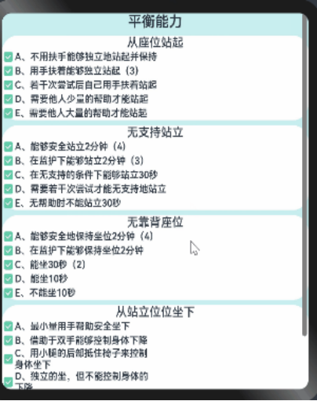

# #星计划#梅科尔工作室HOS-基于多数据融合的下肢康复外骨骼系统
# 前言
 为了完成多数据的展示，让患者更清晰自己的康复情况，我们项目采用鸿蒙APP作为移动端帮助患者随时随地的看到自己的康复情况，但是作为初学者，我们的功能还不完善，还需要继续学习。下面是对我们目前主要的开发功能的介绍。
# 1开发环境
DevEco Studio版本：DevEco Studio 3.1 Release  
HarmonyOS SDK版本：3.1.0（API version9）  
DAYU200.4.0.10.16
# 2项目介绍
我们的项目是由硬件和软件两部分组成。硬件由下肢康复外骨骼对患者进行康复训练。软件部分为鸿蒙APP根据评估患者的结果进行推送，推送的康复动作视频指导患者对康复动作进行及时的纠正和改善，从而使患者的康复效率得到提高。在训练结束后，会对其训练过程中的数据进行整理分析，发送到我们数据展示页面中，能够将患者延续性护理的状况，如平衡能力的提升，走路稳定性的提升，病情在日周月的变化趋势，让患者看到自己病情的变换情况，对脑卒中偏瘫的再次复发起到预防作用。
# 3主要开发功能
## 3.1账号的注册
 注册页面使用了按钮、输入框组件、弹窗组件等组件。弹窗组件是为了提示账号已经注册成功可以正常使用。
 ```
     Text("注册账号")
      .fontSize(50)
      .fontWeight(FontWeight.Bold)
      .margin(20)
    TextInput({placeholder:'请输入你的手机号或者邮箱'})
      .placeholderColor("rgb(105,105,105)")
      .placeholderFont({size:20,weight:120,family:'cursive'})
      .height(50)
      .width('80%')
      .fontSize(30)
      .fontWeight(FontWeight.Bold)
      .margin({top:30})
    TextInput({placeholder:'请输入你的密码'})
      .type(InputType.Password)
      .placeholderColor("rgb(105,105,105)")
      .placeholderFont({size:20,weight:120,family:'cursive'})
      .height(50)
      .width('80%')
      .fontSize(30)
      .fontWeight(FontWeight.Bold)
      .margin({top:30})
    TextInput({placeholder:'请再次确定你的密码'})
      .type(InputType.Password)
      .placeholderColor("rgb(105,105,105)")
      .placeholderFont({size:20,weight:120,family:'cursive'})
      .height(50)
      .width('80%')
      .fontSize(30)
      .fontWeight(FontWeight.Bold)
      .margin({top:30})
    Button("确定注册")
      .height(50)
      .width(180)
      .backgroundColor("#66CDCA")
      .margin({top:40})
      .onClick(() => {
        AlertDialog.show(
          {
            title: '注册账号',
            message: '账号注册成功',
            confirm: {
              value: '确定',
              action: () => {
                console.info('通过')
              }
            },
            cancel: () => {
              console.info('结束')
            }
          }
        )
      })
    Button("返回登录")
      .height(50)
      .width(180)
      .backgroundColor("#66CDCA")
      .margin({top:40})
      .onClick(()=>{
        router.pushUrl({
          url:'pages/login',
        })})
```
 

## 3.2账号的登录
 登录界面使用了，输入框、按钮和单选框。同时还使用了一个条件判断，根据usernam_rag正则表达式验证用户名格式，如果不符合要求则显示错误提示。
 ```
    Image("/common/images/logo.jpg")
      .width(100).height(100)
    Column({ space: 5 }) {
      Text("下肢康复系统")
        .fontSize(45)
      Text("登录账号以使用更多服务")
        .fontSize(20).opacity(0.5)
    }
    
    TextInput({ placeholder: "请输入账号",text:this.username })
      .height(50)
      .width("85%")
    if(this.username_rag.test(this.username)){
      Text("用户名至少输入五位")
        .fontSize(12)
        .fontWeight(700)
        .fontColor("#ff0000")
        .width("80%")
    }
    TextInput({ placeholder: "请输入密码", text: this.password })
      .type(InputType.Password)
      .height(50)
      .width("85%")
    Row() {
      Button("短信验证码登录")
        .width(180).height(30).backgroundColor("#ffffff").fontColor("#0d110e")
      Button("忘记密码")
        .width(150).height(30).backgroundColor("#ffffff").fontColor("#0d110e")
    }
    .justifyContent(FlexAlign.SpaceBetween).width("100%")
    
    Button("登录")
      .width(180).height(50).backgroundColor("#66CDCA")
      .onClick(()=>{
        router.pushUrl({
        url:'pages/my'
      })})
    Button("注册账号")
      .width(180).height(50).backgroundColor("#66CDCA")
      .onClick(()=>{
        router.pushUrl({
        url:'pages/register'
        //              params:{aa:'333'}
      })})
    // .onClick(()=>{
    Row({ space: 50 }) {
      Column({space:5}) {
        Button("QQ")
          .width(60).height(60).backgroundColor("#66CDCA").fontSize(10)
        Text('QQ登录')
          .fontSize(15)
      }
      Column({space:5}) {
        Button("微信")
          .width(60).height(60).backgroundColor("#66CDCA").fontSize(10)
        Text('微信登录')
          .fontSize(15)
      }
      Column({space:5}) {
        Button("微博")
          .width(60).height(60).backgroundColor("#66CDCA").fontSize(10)
        Text('微博登录')
          .fontSize(15)
      }
    }
    
      
    点击勾选服务隐私协议。
    Checkbox({name: 'checkbox2'})
        .select(false)
        .selectedColor('#66CDCA')
      Text("请同意《服务条款》《隐私政策》《儿童隐私政策》")
        .fontSize(15).fontColor("rgb(105,105,105)")
    }
```
  
使用了一个条件判断，根据usernam_rag正则表达式验证用户名格式，如果用户名输入少于五位就会出现图1.3的提示
```
    private username_rag = /^[A-Za-z0-9]{5,8}$/;
    if(this.username_rag.test(this.username)){
      Text("用户名至少输入五位")
        .fontSize(12)
        .fontWeight(700)
        .fontColor("#ff0000")
        .width("80%")
    }
```
## 3.3评估功能
在评估页面，使用了轮播图组件，用于展示评估不同方面的问卷，并且通过ForEach方法遍历imageSrc数组。在实现的过程中，定义了一个ImageData的类，并且在构造initializeImageData的函数中，对这个类的三个属性：ID（图片的表示），img(图片资源)和name(图片名称)，进行赋值。而且还定义了两个私有属性，imgSrc：用于储存数据数组，swiperController:用于控制轮播功能。
```
    export class ImageData {
      id: string
      img: Resource
      name: string
    
      constructor(id: string, img: Resource, name: string) {
        this.id = id // 图片唯一表示
        this.img = img // 图片资源
        this.name = name // 图片名称
      }
    }
    export function initializeImageData(): Array<ImageData> {
      let imageDataArray: Array<ImageData> = [
        { "id": "0", "img": $r('app.media.hunmi'), "name": '格拉斯哥昏迷量表' },
        { "id": "1", "img": $r('app.media.huodong'), "name": '卒中病人运动能力评估表' },
        { "id": "2", "img": $r('app.media.chifan'), "name": '日常生活活动能立量表' },
        {"id":"3","img":$r('app.media.pingheng'), "name":'Berg平衡能力量表'}
      ]
      return imageDataArray
    }
    @Entry
    @Component
    struct Index {
      private imageSrc: ImageData[] = initializeImageData()
      private swiperController: SwiperController = new SwiperController()
    
      build() {
        Flex({ direction: FlexDirection.Column, alignItems: ItemAlign.Center, justifyContent: FlexAlign.Center }) {
          Text("脑卒中评估量表")
            .fontSize(60)
            .fontWeight(800)
            .margin(10)
          Swiper(this.swiperController) {
            ForEach(this.imageSrc, item => {
              Image(item.img)
            }, item => item.name)
          }
          .height("60%")
          .width("100%")
          .margin({ top: 0 })
    
          Row({ space: 60 }) {
            Button('showNext')
              .height(60)
              .width(180)
              .onClick(() => {
                this.swiperController.showNext()
              })
            Button('showPrevious')
              .height(60)
              .width(180)
              .onClick(() => {
                this.swiperController.showPrevious()
              })
          }
          .margin({top:10})
          Text("温馨提示：" +
          "评估分数仅供参考，以病人的实际情况为例")
            .fontColor("#ff0000")
            .margin({top:10})
        }.margin(30)
    
    
      }
    }
```
  
通过onClick触发点击图片。入评估问卷界面，通过对页面问题的回答来判断患者具体的身体情况。
 ```
     Swiper(this.swiperController) {
            Image($r('app.media.pingheng')).width('85%').height(400).onClick(()=>{  router.push({
              url:'pages/pinggu1',
              params:{aa:'333'}
            })})
            Image($r('app.media.huodong')).width('85%').height(400).onClick(()=>{  router.push({
              url:'pages/pinggu2',
              params:{aa:'444'}
    
            })})
            Image($r('app.media.chifan')).width('85%').height(400).onClick(()=>{  router.push({
              url:'pages/pinggu3',
              params:{aa:'555'}
            })})
            Image($r('app.media.hunmi')).width('85%').height(400).onClick(()=>{  router.push({
              url:'pages/pinggu4',
              params:{aa:'666'}
            })})
    /      }
```

## 3.4播放康复视频
 播放康复视频，让患者随着康复视频一起做动作，从而达到训练的目的。播放视频的页面使用了视频播放器和按钮等组件，也是用了视频源、预览封面、播放倍速、控制器等属性，同时还设置了视频组件的一些行为：静音、自动播放、控制栏显示模式、循环播放等。
 ```
    Text(this.message)
      .fontSize(50)
      .fontWeight(FontWeight.Bold)
    Video({
      src: $r('app.media.stage21'),
      previewUri: this.previewUris, // 视频封面
      currentProgressRate: this.currentProgressRate, // 视频播放倍速
      controller: this.controller,
    
    })
      .muted(this.muted) // 是否静音
      .autoPlay(this.autoPlay) // 是否自动播放
      .controls(this.controls) // 控制视频播放的控制栏是否显示
      .objectFit(ImageFit.Contain) // 视频显示模式
      .loop(this.loop) // 是否单个视频循环播放
      .height("60%")
      .onStart(() => {
        // 播放时触发该事件
        console.info('onStart');
      })
      .onPause(() => {
        // 暂停时触发该事件
        console.info('onPause');
      })
      .onFinish(() => {
        console.info('onFinish');
    
      })
      .onError(() => {
        // 播放失败时触发该事件
        console.error('onError');
      })
      .onFullscreenChange((e) => {
        console.info('视频进入和退出全屏时触发该事件：' + e.fullscreen)
      })
      .onPrepared((e) => {
        console.info('视频准备完成时触发该事件：' + e.duration)
      })
      .onSeeking((e) => {
        console.info('操作进度条过程时上报时间信息：' + e.time)
      })
      .onSeeked((e) => {
        console.info('操作进度条完成后，上报播放时间信息：' + e.time)
      })
      .onUpdate((e) => {
        console.info('播放进度变化时触发该事件：' + e.time)
      })
      .height("30%")
    Row({}) {
      Flex({ wrap: FlexWrap.Wrap, justifyContent: FlexAlign.SpaceAround, alignItems: ItemAlign.Center }) {
        Button("开始训练")
          .height(40)
          .width(180)
          .onClick(() => {
            this.controller.start()
          }).margin(8)
        Button("结束训练")
          .height(40)
          .width(180)
          .onClick(() => {
            this.controller.pause()
          })
```

# 4展望
希望日后能跟着官方文档进行更深度的学习、开发鸿蒙APP，同时也希望随着我们开发程度的加深，我们的多数据融合可以和鸿蒙的多设备融合协同工作，为更多了脑卒中患者提供帮助，助他们早日康复。


